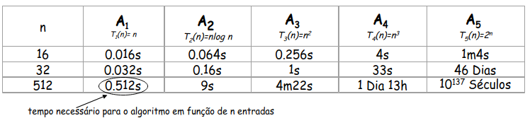
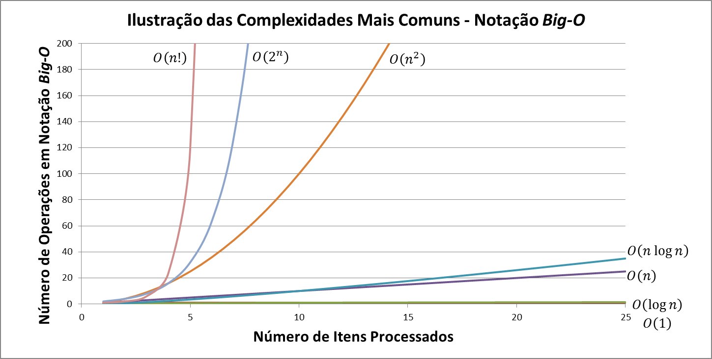

<h1 align="center">Estrutura de Dados e Algoritmos</h1>

<p align="justify">Este repositório foi feito com a finalidade de compartilhar um pouco do meu conhecimento sobre o estudo de Estruturas de Dados e Algoritmos, no qual estou aprendendo na minha faculdade. O conteúdo estará divido em pastas de maneira organizada, cada uma contendo seu próprio README para facilitar o estudo e possíveis consultas futuras. Espero que esse conhecimento possa ajudar de alguma forma a você que caiu aqui de paraquedas! 😄</p>

<div align="center" style>
  <h3>Linguagem Utilizada:</h2>
  
</div>

<h3 align="center">Sumário</h3>
<p align="center">
  <a href="#conceitos-basicos">Conceitos Básicos</a> -
  <a href="#analise-algoritmos">Análise de Algoritmos</a> -
  <a href="#complexidade-algoritmos">Complexidade de Algoritmos</a>
</p>

### Conteúdos do Repositório 📝
- [ ] Algoritmos
- [ ] Listas
- [ ] Filas
- [x] Pilhas
- [ ] Árvores
- [ ] Tabela Hash

<h2 id="conceitos-basicos">Conceitos Básicos 🤔</h2>

### O que é um Algoritmo?
- Uma sequência finita de instruções lógicas que resolvem uma determinada tarefa.

### O que é uma Estrutura de Dados?
- Modo de armazenamento e organização de dados em um computador, de modo que eles possam ser utilizados de forma eficiente.

### Estrutura de Dados x Algoritmos
- <p align="justify">Estamos sempre lidando com algoritmos, principalmente no universo da programação. Utilizamos algoritmos para manipular dados e, quando organizamos esses dados tornando nossas operações com eles mais eficientes e coerentes, temos uma <strong>estrutura de dados</strong>.</p>

<h2 id="analise-algoritmos">Análise de Algoritmos 📈</h2>

<p align="justify">A análise de algoritmos tornou-se essencial. A comparação de um determinado algoritmo com outro é importante para tirarmos conclusões de ambos e, dessa forma, escolhermos o algoritmo mais eficiente para uma determinada situação.</p>

Os tipos de dados que podem ser utilizados para analisar um algoritmo são:
- **Dados Reais**: Entregam a verdadeira medida do tempo de execução.
- **Dados Aleatórios**: Assegura que as experiências testam o algoritmo e não apenas os dados específicos. Representa situação de caso **médio**.
- **Dados Perversos**: Mostram que o algoritmo funciona com qualquer tipo de dado. Representa a situação de **pior** caso.
- **Dados Benéficos**: Mostram que o seu algoritmo funciona apenas com os tipos de dados esperados. Representa a situação de **melhor** caso.

Realizar uma análise **precisa** de um algoritmo é uma tarefa complicada pois são considerados muitos fatores, tais como:
- A linguagem em que determinado algoritmo é implementado.
- O hardware da máquina em que o programa será executado.
- É difícil prever tempos de execução de cada instrução e antever otimizações.
- Muitos algoritmos não são bem compreendidos.

<p align="justify">Entretanto, ainda é feita a análise de algoritmos a partir de modelos matemáticos simples, que ignoram o hardware e o software escolhidos para executar o programa, e nos trazem uma previsão do tempo de execução do algoritmo.</p>

<p align="justify">Para melhor ilustrar essa situação, imagine 5 algoritmos diferentes feitos para realizar um mesmo tipo de situação (A1, A2, A3, A4 e A5). Podemos calcular a eficiência de cada um desses algoritmos a partir de uma função que calcula o número de operações que um determinado algoritmo efetua para <strong>N</strong> entradas. Essa função é chamada <em>Tĸ(n)</em>.</p>

<p align="justify">Em que <em>T</em> significa o Tempo de Execução do Algoritmo. <em>k</em> é a variável que indica qual é o algoritmo (A1, A2, A3, A4 ou A5) e o <em>n</em> indica a quantidade de entradas.</p>

A imagem abaixo ilustra o funcionamento desses algoritmos:

**OBS** - Considere que cada operação leva 1ms para ser efetuada.

<div align="center"></div>
<br>
<p align="justify">Note que para um tamanho de entrada igual a 512 (n = 512), para resolver um mesmo tipo de problema, existem algoritmos que demoram 10¹³ séculos para terminar a execução (algoritmo A5) e outros que demorariam 0.512s para completá-la (algoritmo A1). Perceber essa diferença só foi possível analisando os algoritmos, e assim, podemos escolher o melhor deles para resolver uma determinada situação.</p>

<p align="justify">Repare também que, na mesma tabela, logo abaixo das letras dos algoritmos, temos algumas funções como <strong>n</strong>, <strong>nlog n</strong>, <strong>n²</strong>, <strong>n³</strong> e <strong>2^n</strong>. Essas funções representam a Complexidade de cada um desses algoritmos, estudaremos ela logo em seguida!</p>

<h2 id="complexidade-algoritmos">Complexidade de Algoritmos 📉</h2>

<p align="justify">A Complexidade de Algoritmos consiste na quantidade de instruções necessárias para a sua execução, expressa em função das operações fundamentais, que podem variar de acordo com cada algoritmo e volume de dados. A complexidade de um algoritmo pode ser dividida em:</p>

- **Complexidade Espacial**: Mede a quantidade de recursos utilizados para resolver o problema.
- **Complexidade Temporal**: Mede a quantidade de tempo utilizado para resolver o problema.

Em ambos os casos a complexidade é sempre medida de acordo com o volume de dados da entrada (N). Existem também 3 escalas de complexidade:
- **Melhor caso**: Analisa a complexidade do algoritmo no melhor caso. Geralmente sem utilidade prática.
- **Médio caso**: Geralmente de difícil determinação, nem sempre utilizado.
- **Pior caso**: Analisa a complexidade do algoritmo no pior caso. Bastante útil, pois obtemos um limite superior para N entradas do algoritmo além desse caso ocorrer com frequência. Para representar esse tipo de caso é adotada a letra **O** (Notação Assintótica). 

_Exemplo: Um algoritmo que faz uma busca sequencial em uma lista de N entradas. No pior caso, terá que percorrer a lista toda e muitas vezes não achará o elemento, logo, irá percorrer as N entradas no pior caso. Então o algoritmo possui complexidade **O(N)**_.

### Como medir a Complexidade de um Algoritmo?

<p align="justify">Os algoritmos são divididos em Classes de Problemas de acordo com o parâmetro que afeta o seu comportamento de forma significativa, são elas:</p>

1. **Complexidade Constante**
2. **Complexidade Linear**
3. **Complexidade Logarítmica**
4. **Nlog N**
5. **Complexidade Quadrática**
6. **Complexidade Cúbica**
7. **Complexidade Exponencial**

Abaixo veremos detalhes de cada uma delas.

### 1. Complexidade Constante
- São algoritmos de complexidade **O(1)**.
- Independe do tamanho de N entradas.
- É o único em que as instruções do algoritmo são executadas em um tamanho fixo de vezes.

_Exemplo:_ 
```C
int x = 4; // O(1)
int y = 8; // O(1)
int z; // O(1)

x = x * 2; // O(1)
z = x + y; // O(1)
```
### 2. Complexidade Linear
- São algoritmos de complexidade **O(N)**.
- Uma operação é realizada em cada elemento de entrada.

_Exemplo: Busca de elementos em uma lista_
```C
int lista[5] = {1, 2, 3, 4, 5}; // O(1)
int elemento = 10; // O(1)

int i; // O(1)
for (i = 0; i < 5; i++) { // O(N)
  if (lista[i] == elemento) {
    printf("Elemento encontrado!");
    break;
  }
}
```
### 3. Complexidade Logarítmica
- São algoritmos de complexidade **O(logN)**.
- Ocorre tipicamente em algoritmos que dividem o problema em problemas menores.

_Exemplo: Algoritmo de Busca Binária_
### 4. Complexidade Nlog N
- São algoritmos de complexidade **O(Nlog N)**.
- Ocorre tipicamente em algoritmos que dividem o problema em problemas menores, mas juntam posteriormente à solução de outros problemas menores.

_Exemplo: A maioria dos algoritmos de ornenação externa são de complexidade O(Nlog N)_
### 5. Complexidade Quadrática
- São algoritmos de complexidade **O(N²)**.
- Itens são processados aos pares, geralmente com um loop dentro do outro.

_Exemplo: Percorrendo uma matriz_
```C
int numeros[3][3] = {{1, 2, 3}, {4, 5, 6}, {7, 8, 9}}; // O(1)

// O(N²)
for (int i = 0; i < 3; i++) { // O(N)
  for (int j = 0; j < 3; j++) { // O(N)
    printf("%d ", numeros[i][j]);
  }
}
```
### Complexidade Cúbica
- São algoritmos de complexidade **O(N³)**.
- Itens são processados dentro de 3 a 3, geralmente com um loop dentro de outros dois.

_Exemplo:_
```C
int mat[3][2] = {3}; // O(1)
int vet[5] = {1, 2, 3, 4, 5}; // O(1)

// O(N³)
for (int i = 0; i < 3; i++) { // O(N)
  for (int j = 0; j < 2; j++) { // O(N)
    for (int k = 0; k < 5; k++) { // O(N)
      mat[i][j] = mat[i][j] + vet[k]; // O(1)
    }
  }
}
```
### Complexidade Exponencial
- São algoritmos de complexidade **O(2^N)** (Escreve-se "dois elevado a N).
- Utilizam **força bruta** para resolver um problema, geralmente possuem abordagem simples.
- Não é útil do ponto de vista prático.

_Exemplo: Algoritmo da [Torre de Hanói](https://www.lavanguardia.com/vida/20181215/453378236845/solucion-enigma-torre-hanoi-fin-mundo.html) para 64 discos_

<br>
Abaixo você pode verificar o gráfico de comparação de cada complexidade de algoritmos:

<div align="center"></div>

<br>
<p align="center">Agora que já temos a base do assunto, nas pastas do repositório temos o estudo mais detalhado de tipos de algoritmos e estrututuras de dados. Obrigado por ler até aqui! 😄</p>
